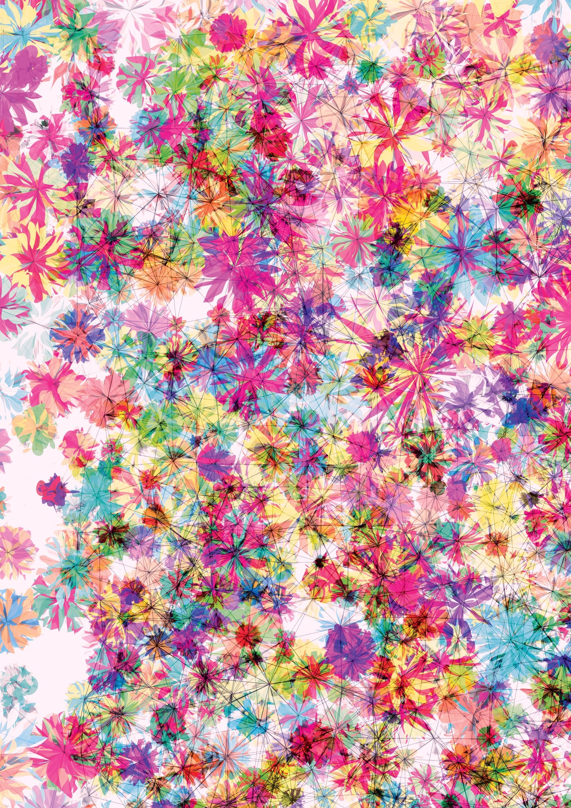
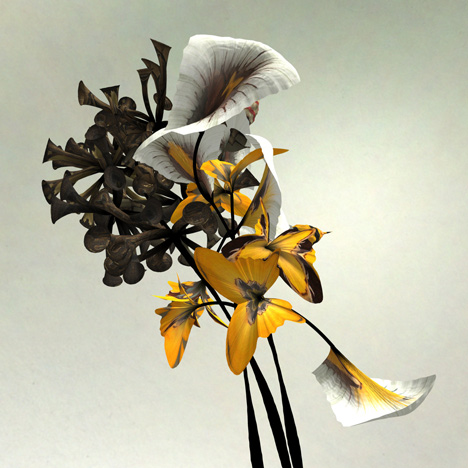
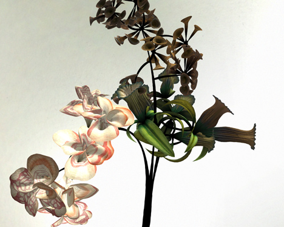
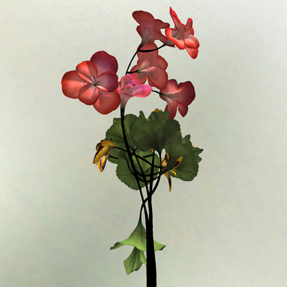

# Blog post on two artists or art pieces that I enjoy that use algorithms in their practice
------
### Florada

I was first drawn to this piece by its intense and vibrant colors, and found it really pleasing to the eye. It’s fascinating how a piece generated by a computer — perceived as a cold, logical machine — can recreate the expressive beauty and bright, harmonious aesthetic of flowers. I find the duality of the organic — represented by the soft but precise curves and shapes that make up the “flowers” — and the geometric — represented by the straight lines forming some sort of mesh — really compelling. I like how the different levels of transparency of the elements in the piece creates the appearance of depth, and makes the piece look textured and rich, despite it being a flat, digital, 2D image. There isn't much information on this intent or process behind creating this specific piece, but it was interesting reading up more about its artist John Maeda, whom I learned is actually one of the most accomplished and preeminent generative artists of our time. Maeda's 1999 book, Design by Numbers is credited as the inspiration for Casey Reas' creation of the programming language Processing.

### Darwin

I wanted to learn more about other computer-generated or algorithmically created representations of flowers, and discovered Daniel Brown's series of 3D, generative animated flowers. I was drawn to how life-like and natural they look, and by the fact that "cold", logical mathematical equations can create, as the artist puts it, "hyper-real organic behaviour". I also find it interesting how every flower is unique as a result of the process of creating these flowers -- the shapes of stems and flowers are first created using mathematical equations, and then arranged and texturized according to rules derived from the computer analysis of real historical taxidermy and plant images. Interestingly, not only were plant samples used as a source -- animals were used as well. This means the patterns and arrangement could be influenced by non-plant parts, for example the plumage of birds. I find the composite nature of the flowers extremely fascinating, especially since it means that these hyper-realistic looking flowers cannot and do not actually exist in reality.

More of Daniel Brown's generative flowers:

