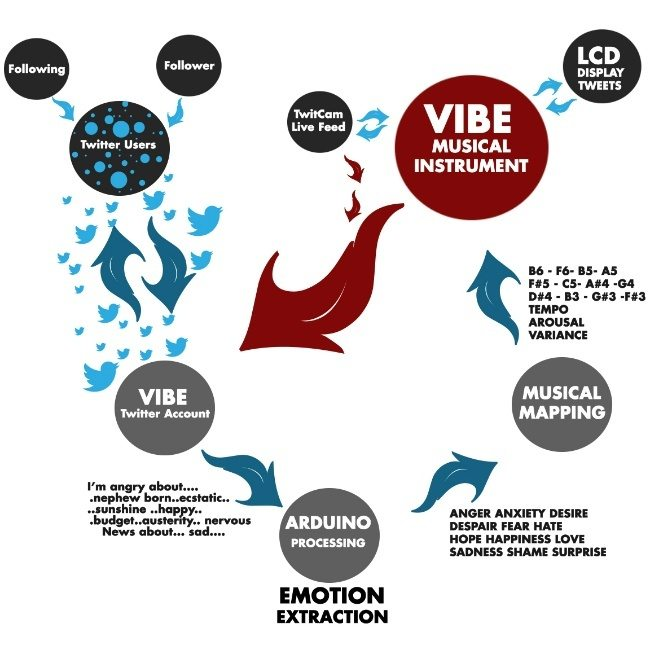
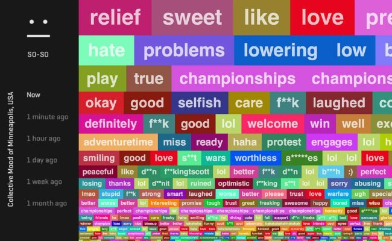
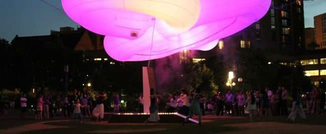

# Blog post on two cybernetic art pieces that I enjoy

------
### Social Vibes

This art piece consists of a collection of metal keys and tubes and motorized valves and strikers that are controlled with an Arduino processor running a sketch written in Processing. As Twitter users globally send out their tweets, the processor conducts sentiment analysis on the tweets (by looking out for emotional keywords), and the instrument plays a specific note across four octaves according to the sentiment identified (similar emotions are grouped on similar parts of the music scale), in real time. As such, the higher the volume and velocity of the tweets coming in, the more frantically notes are produced -- I find this responsive element of the art piece very fascinating. I was first drawn to this piece by its intricate architecture and the fact that the machine learning employed is both analytical/discriminative -- with the sentiment analysis -- and generative in nature -- with the music generation. It's compelling how the emotions of people tweeting go through various levels of interpretation, transformation and translation: First, these emotions originate the mind/physiology of the person experiencing the emotion, possibly in response to some other event. Then, they are expressed textually in the form of a tweet, and are next converted to a feature dataset used in the machine learning/natural language processing analysis. Following that, they are classified as being of following labels -- anger, anxiety, desire, despair, fear, hate, hope, happiness, love, sadness, shame and surprise -- and finally, they are re-released to the world in the form of musical notes, which themselves evoke emotional responses in listeners.

[Here's a link to a video showing the art piece in action.](https://vimeo.com/74341695)

### City Mood Ring

I find the notion of emotional expression and flows through analyzing and translating tweets in real time to be very interesting, and wanted to feature another art piece that explored similar ideas and methods. Instead of conveying processed emotions musically/aurally, City Mood Ring does so visually in the form of an inflatable sculpture with LED bulbs that displays colours according to the sentiment analyzed and aggregated from the Twitter stream of Minneapolis residents. More positive emotions result in warmer colours, and more negative result in cooler colours, and the colours similarly also change in tandem with and at the same rate of tweets coming in. One interesting difference with this piece is that visitors themselves contribute to this art piece -- when people approach the sculpture, and their proximity can shift the overall colour display in a warmer direction. I interpret this as how when there is someone bearing witness to how one is feeling, the presence of an observer/listener to one's emotions generally makes one feel better or at least, less bad, which is a very salient and important message in the context of cities that might seem like cold, disconnected and isolating places for some residents.

More photos of the art piece:

[Here's a link to a video showing the art piece in action.](https://vimeo.com/68778348)
