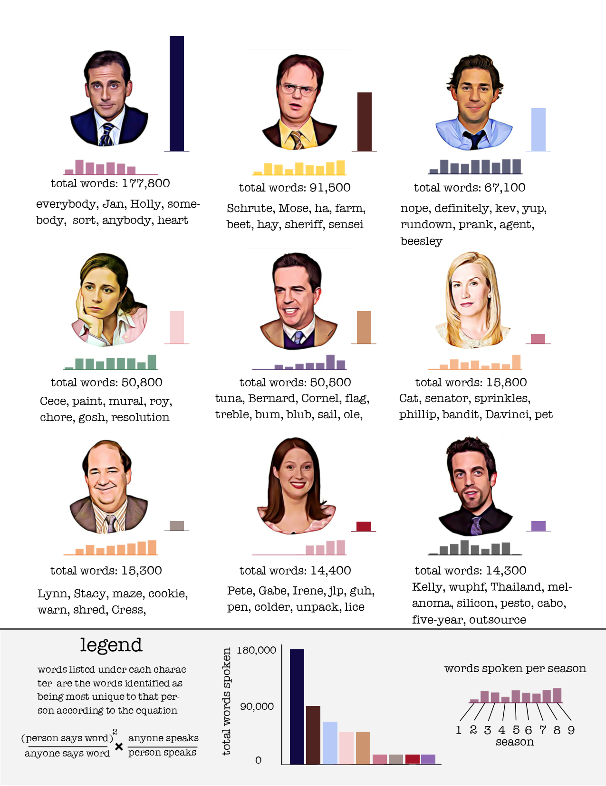

# Blog post on two pieces that use data in some way
------
### The City is Alive: The Population of Manhattan, Hour-by-Hour

I really enjoy this visual narrative about the movement and location of people in Manhattan across time and space. In terms of practical utility, this time-series geo-spatial model of block-by-block population of Manhattan across a week is very information dense and gives a good sense on the population flow and activity of the city. However, more than that, I feel the visualization is also aesthetically pleasing and beautifully represented, successfully conveying the dynamism and energy of the Manhattan and its people. Indeed, the rhythmic up-and-down/shrinking-and-growing movement of the 3D bars representing the count of people in each area resembles a pulse, making Manhattan feel alive. The appearance of the bars in different intensities of red according to the level of population density seems to suggest that the people are the lifeblood of the city. Additionally, despite conveying a high level of detail -- it provides complex information that varies with both time and space -- it still manages to be very simple, clean and minimalist. It's also interesting reading more about the author's methodology. Apparently, he used publicly available transit activity data (subway turnstile counts) from the MTA in order to built his model -- what a creative and ingenious way of obtaining information about people's movements! All-in-all, I find this a very effective and visually appealing piece that was the result of a fascinating data collection and transformation process.

[Here's a link to a presentation detailing the author's methodology.](https://github.com/citrusvanilla/manhattanpopulationexplorer/blob/master/presentation/120507_turnstile_presentation.pdf)

[Here's a link to the interactive webtool for this visualisation.](https://manpopex.us/)

### 'The Office' Characters' Most Distinguishing Words

As a fan of The Office, I appreciated how this infographic really painted a relatively accurate picture of the characters in the show. I was drawn to this infographic as someone who's interested in text-mining and natural language processing (NLP), and I found this to be a very interesting and use of NLP. I enjoy how the "avatars" for each character are beautifully illustrated and coherent with each other, the typographic choice is great, the color palette is aesthetically pleasing and complementary with the illustrations, and there is a legend that succinctly and clearly communicates how the infographic should be interpreted as well as outlines how the equation/formula used by the author. I like how this infographic was the result of an relatively complex and technical data transformation/text mining process but still manages to be accessible, simple and engaging for non-technical audiences. 
