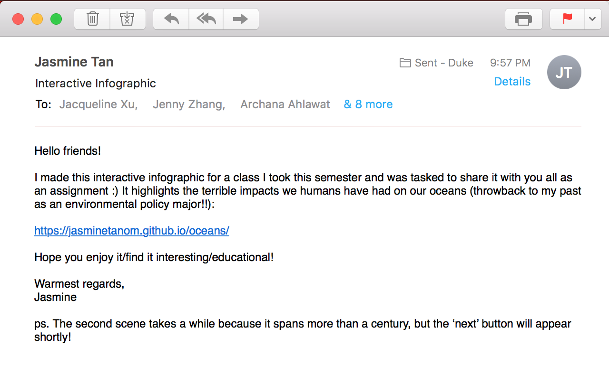
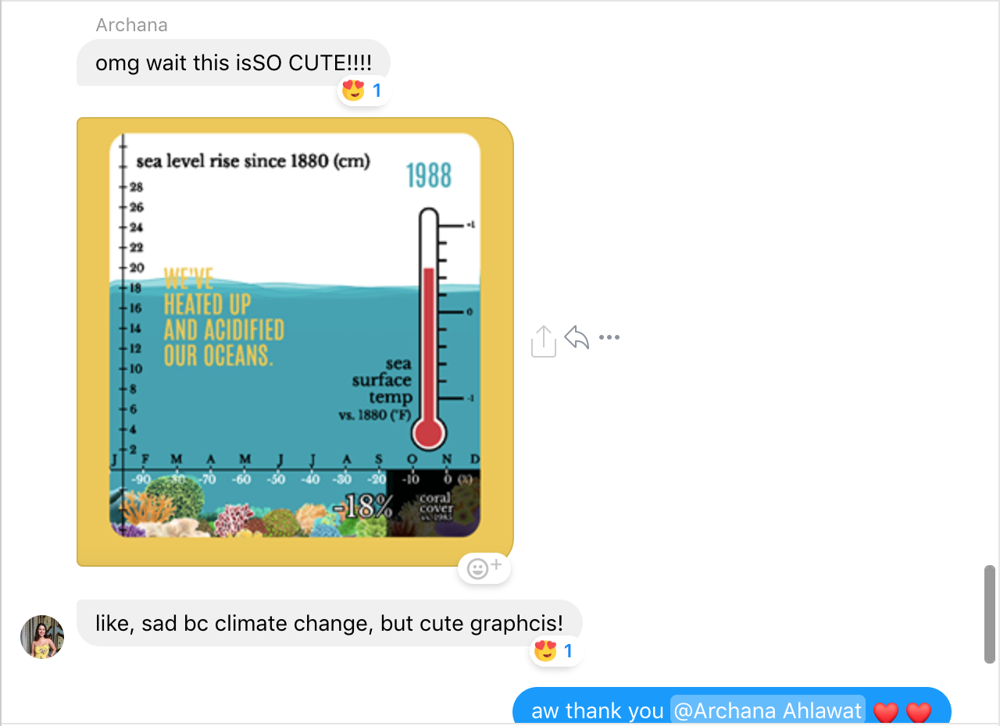
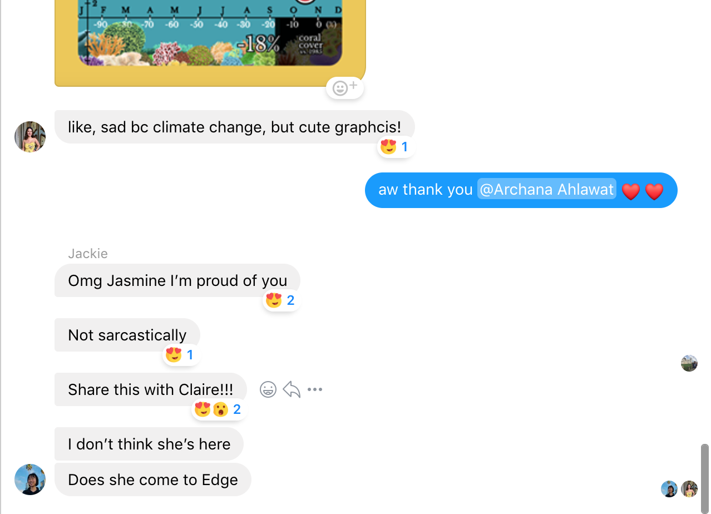
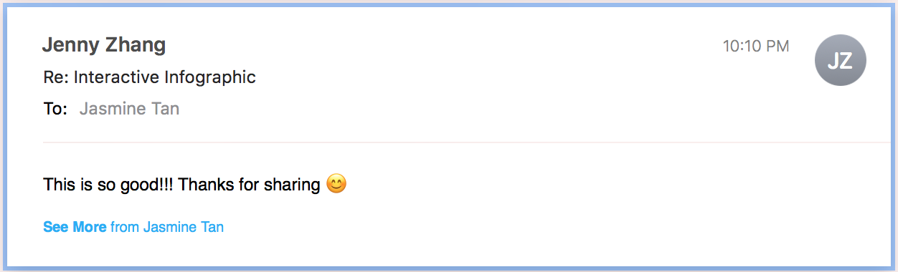

# Sharing my work, and final reflections

------
### Sharing my work

I struggle with feeling confident about my work, and thus with some apprehension, I emailed 11 friends about my final project:

To my great surprise and joy, I received heart-warming responses:

I guess from now on, I'll make more attempts to share and promote my work, and put in more effort into overcoming any self-consciousness I feel -- thanks Matt for requiring that we do this! :)

### Final Reflections

I've previously always gravitated towards the back-end of software development. I'm sincerely grateful that I had the opportunity to learn from Matt this semester and to think critically and creatively about developing pieces that users interact with directly. I do also enjoy graphic design, but I've always only limited myself to working with static designs in Adobe Illustrator and Photoshop. This course helped me explore the intersection of both of my interests and discover how I could design with code, and code to design. Indeed, working with p5.js was very exciting and empowering for me -- It's a really powerful yet flexible library, and it was incredibly fun to see the "sketches" in my code editor come to life.

I've never taken an art course in my entire life, and appreciated the blog posts where we were tasked to find art pieces we enjoyed and explain why we did so. Having never engaged in such reflections and analyses before, it was challenging at times to both find art pieces that spoke to me as well as to articulate why exactly they struck a chord with me. Additionally, having always been instructed exactly and specifically what to do in every assignment I've had, the fact that for the first time, I was tasked with projects that were so open-ended confused me at first. Initially, I did not know how to work with so much freedom at hand and struggled each time in envisioning how and what I wanted my projects to be. Ultimately, however, I came to deeply enjoy the unlimited, unrestricted and undetermined nature of the projects -- it was liberating, and meant that I could truly engage and dive into what interested me and what called to me aesthetically and emotionally.

Perhaps as a result of the fact that I was new to the world of art, I found Matt's lectures incredibly interesting and helpful in understanding, contextualizing and appreciating new media art, and had great takeaways from them. All-in-all, I gleaned so many insights from this class and found it to be greatly enriching and enjoyable. Moving forward, I intend to re-work some of my pieces over the summer and re-visit the concepts we covered throughout the semester, as well as explore some ideas and themes that I did not include in my projects (like machine learning and human-computer interaction), so that I can continue the progress I've made as both a designer and software developer in this class.
