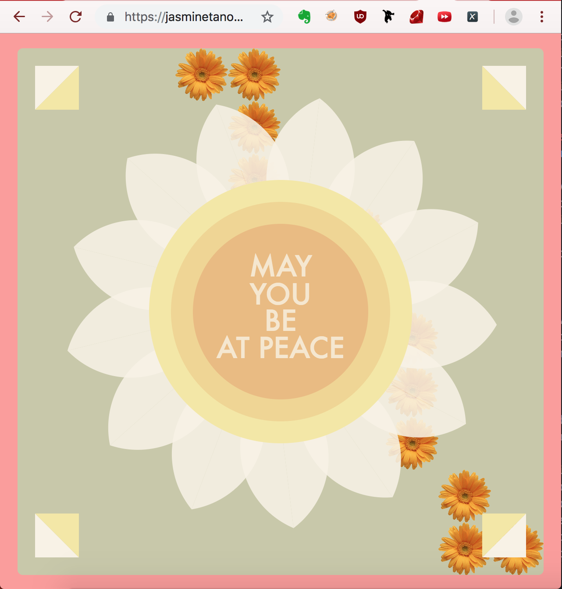

# Blog post on "Hello World" creation and on 'What is Art?'
------
### "Hello World" creation

In my yoga class last semester, I learned about the concept of 'Ahimsa' -- the doctrine of non-violence and benevolence towards all living things, including oneself. As someone who struggles with anxiety and a harsh inner critic, this concept resonated deeply with me, and I discovered a tangential practice of loving kindness (mettā) meditation, which consists of consists of silent repetitions of phrases such as "may you be happy" or "may you be at peace", directed at a person/living being, whom depending on tradition, may or may not be internally visualized. In the version I practice, the target of one's well-wishes begins with oneself, but this goodwill extends outwards, first to one's loved ones, then to people about whom one feels neutral, to people with whom one has a difficult relationship, and finally to all living beings. I wanted to share my experience/practice with my family -- especially my mother, who shares a lot of similar struggles as I do. For my first project, I thus envisioned creating an external manifestation of what I visualized internally that would help evoke a sense of calmness and tranquility and encourage loving-kindness towards oneself and others.

My audience is anyone who needs or desires inner peace, especially people who have forgotten to be compassionate towards themselves. In order to inspire a sense of hopeful peace and tranquility, I chose a floral theme that represents life, new beginnings, love and beauty, and a soft and gentle yet vibrant color palette -- reminiscent of Spring -- to complement this theme. Along the same vein, I wanted to keep any flashy animations to a minimum, with a few simple, but effective interactive elements. One such element was the flowers appearing with the mouse movements, intended to be simulate the watering and blooming of a garden, and thus spark joy.

Other interactive elements were employed to fulfil my intention of creating a representation of my loving-kindness meditative practice. The concentric circles (which change the target of ones' goodwill when clicked) represent the concept of radiating benevolence outwards, and the clickable squares allow one to customize/switch up the phrase one repeats. I designed the mantra text to flash slowly and gently in time with one's repetitions of the phrases and one's breath. I hope to extend this piece of mine further by making it a more multi-sensory representation of my practice, perhaps by adding calming sounds of nature that usually accompany me when I meditate.

[Here's a link to a draft of the piece on my site.](https://jasminetanom.github.io/p5js-first-proj/)

### What is art?
I really appreciate Jeff Koons' definition of art as a vehicle of acceptance -- both of oneself and others. I never thought of art this way, but interestingly in hindsight, it seems that perhaps it was something I hoped to achieve with my first project -- to inspire acceptance and thus compassion towards oneself and others. I also truly resonated with Wolfgang Laib's viewpoint of art. One seemingly trivial part of his interview which moved me was his statement "I was always here", when he described his pollen collection process. It's beautiful to think about art in that light, as a declaration made to our vast world as well as to oneself of one's presence. I enjoyed how his artistic process seemed like a very meditative, spiritual practice ("it's quiet work which means a lot to me"), as well as a medium which he used to tell his story ("an answer to all I had seen before") and help him gain a sense of peace from the chaos and suffering he had bore witness to in his previous life as a medical doctor. I think there are definitely parallels between Wolfgang Laib's thoughts about art and what I had intended in my first project and the process I undertook. I hope to better develop an authentic personal voice and cultivate a greater intentionality and purpose in my future projects as a means -- as well as a journey -- of sharing my inner world and communicating my story.
