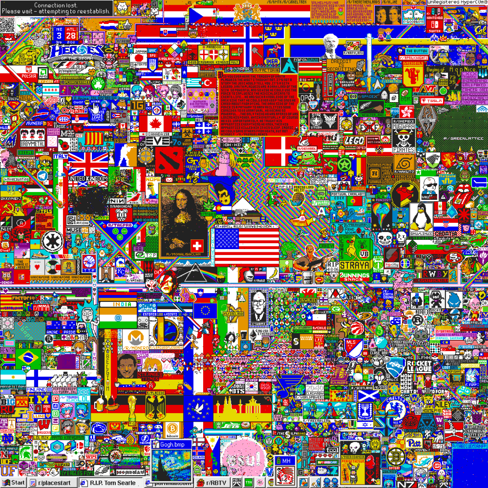
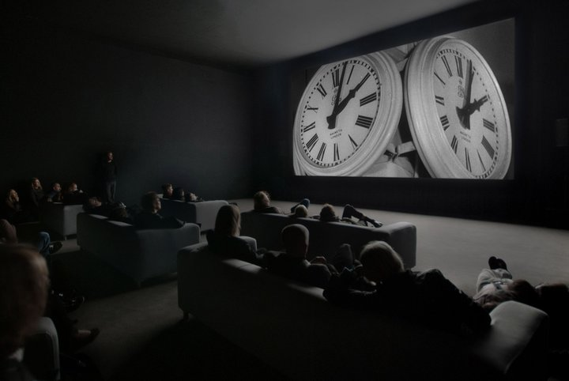

# Blog post on new media art I enjoyed
------
### Art Piece 1

So Many Journeys May the Sun and Moon is a piece of software art by R. Luke Dubois. It was commissioned by the Whitney Museum of American Art for their Artport program as part of a series titled Sunrise/Sunset, which consisted of Internet art projects that marked sunset and sunrise in New York City every day. The art projects were displayed on the museum's website, whitney.org, intended to "disrupt, replace, or engage" with readers of the website that visited during sunset or sunrise. Dubois wrote a program that first located references to the words "sun" and "moon" in Shakepeare's plays and using either of these two words as starting points, then generated the next word that follows the previous word one at a time using a Markov chain. This creates a never-ending remix of Shakespeare's language and metaphor. These words were overlaid onto the pages of whitney.org. I was first attracted to this piece by the formatting/visual appearance of the text -- the colours and psychedelic effect appeared to me reminiscent of Bill Wurtz's videos -- but my appreciation of this piece mainly stems from my own personal experience working and playing around with text generation using Markov models. Previously I had only explored generative Markov models from a purely academic/technical perspective (specifically, examining the mathematics of it and applying it to solve computational genomics problems) and I find the application of such models to create art really fascinating. I also find it interesting how this art piece is meant to be viewed and enjoyed only at specific times of the day.

[Here's a link to the piece on the artist's project page](http://lukedubois.com/)

[Here's a link to a video showing how the piece appeared on the Whitney Museum of American Art's website (0:33)](https://www.youtube.com/watch?v=EwZAUKwPrMU)

[Here's a link to project site on whitney.org](https://whitney.org/exhibitions/r-luke-dubois)

### Art Piece 2

This is Place, a collaborative project that was launched on April Fools’ Day 2017 on social news site Reddit and displayed on the Subreddit r/Place. Over the course of 72 hours, over one million unique users edited an online canvas of one million tiles/pixels. Each user could change the colour of as many pixels as they wanted, anywhere they wanted – one pixel at a time, with a few minutes wait in between each edit -- from a choice of 16 colours. At the beginning pixels were randomly and chaotically placed but soon specially created communities and coordinated efforts were developed that resulted in interesting pixel art like reproductions of the Mona Lisa and Starry Night. I like it because despite having no clearly defined objectives or purpose, it emerged as a collective effort from the unmoderated, unconstrained interaction and contributions of many anonymous individuals. To me, it is a very fascinating snapshot of internet culture – that of collaboration and cooperation, expression and creativity, and the formation of online groups, as well as of course, pranking, trolls and memes. I wouldn't exactly describe the final canvas as very aesthetically pleasing or beautiful, but I appreciate the vibrant colours and the fact that it is organized yet chaotic, coordinated yet authorless -- an artifact of cyberculture and as Gizmodo puts it, a "testament to the internet's ability to collaborate".

[Here's a link to the final Place canvas](https://i.redd.it/agcbmqgjn14z.png)

[Here's a link to a time-lapse video of the canvas over the entire 72 hours (4:32)](https://i.redd.it/agcbmqgjn14z.png)

[Here's a link to the r/Place Subreddit](https://www.reddit.com/r/place/)

(Note: I'm completely new to art and new media, and I do have some doubts on what is considered "art"/new media art and whether this can constituted as a piece of new media art, especially since it isn't really conventionally aesthetically pleasing and there is no clear author and intention associated with it. As we progress through the course and I develop a deeper understanding of the practice and theory of new media art, I hope to be better able to address this issue/question.)

### Art Piece 3

The Clock by video artist Christian Marclay is a looped 24-hour video montage of scenes from film and television that feature clocks or timepieces synchronized with real time. The art piece thus functions as a clock itself. The piece was critically acclaimed and displayed in many museums all around the world but debuted in the London-based White Cube gallery in 2010. There are many reasons why I like this piece. What first drew me to it was the fact that at first glance to me it seemed very simple and straightforward in concept, even kind of banal really -- just combine video clips of clocks together in a video editor, no? -- but on further consideration, I realized how challenging and technically complex it must have been to create. Indeed, Marclay had to form and organize an entire team to watch films to find footage (specifically, clips that fit the narrative Marclay envisioned) of every minute of the day, and working on the transitions between scenes took him a whole three years. His team had to create completely new audio for some scenes and write a specific program that synchronized the audio and video tracks with the current time without continuity errors. Additionally, what attracts me to this piece is the feelings it evoked it me when I watched a snippet of it. The Type A individual in me felt anxious and restless viewing it, as the passage of time as one watches the film is made explicitly clear through the synchronized scenes of the clocks. While viewing it, I was conscious the entire time of the minutes and seconds I was spending on it, and that was quite disconcerting. Another aspect of interest about this art piece is the fact that it is composed solely from the original work of other filmmakers, and I appreciate how such sublime work can be entirely derivative in nature. Lastly, I think it's interesting how this piece of work is best enjoyed and its concept respected only when displayed at a certain time of the day. The video snippet I viewed instructed the audience to "wait for tomorrow or another day" to play the video if it was not the specific time featured in the footage, and I liked how "opinionated" this piece is in its emphasis of how it should be interacted with.

[Here's a link to a video snippet of The Clock corresponding to 12:04pm, local time (3:32)](https://www.youtube.com/watch?v=xp4EUryS6ac)
